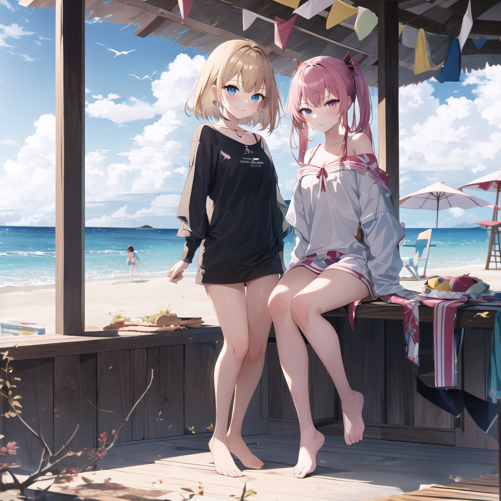

## Introduction

The Latent Couple technique allows for the generation of complex images with distinct regions, each influenced by separate prompts and LoRA models. This method is particularly useful in scenarios where different subjects or elements need to be emphasized within a single composition.

## Video Tutorial

For a visual guide, refer to this [Video Tutorial](https://youtu.be/uR89wZMXiJ8) by **Aitrepreneur**.

## Notice

**Important:** As of February 6, 2024, this feature is broken in `v1.7.0` of the **WebUI** due to an issue documented [here](https://github.com/a2569875/stable-diffusion-webui-composable-lora/issues/32). Please ensure compatibility before proceeding.

## Requirements

Before you begin, ensure that you understand how to install [Extensions](../README.md#extensions).

### Necessary Extensions

1. **two-shot (Latent Couple)** - [GitHub Repository](https://github.com/ashen-sensored/stable-diffusion-webui-two-shot)
2. **composable-lora** - [GitHub Repository](https://github.com/a2569875/stable-diffusion-webui-composable-lora)

Ensure these extensions are installed before moving forward.

## How to Use

Upon successful installation of the extensions, you will find two new sub-sections under the **txt2img** and **img2img** tabs: **Composable Lora** and **Latent Couple**.

### Composable Lora

Enable **Composable Lora** if your goal is to utilize different LoRAs or LyCORIS models, especially when generating distinct characters in each region.

### Latent Couple

When accessing the **Latent Couple** section, you will see two modes:

1. **Mask**:
   - Upload an image where regions are marked with distinct colors.
   - Click on **I've finished my sketch** to automatically identify and fine-tune the regions.

2. **Rectangular**:
   - This mode allows manual input to divide regions based on coordinates and dimensions.
   - It's often easier and more straightforward for users.

#### Field Explanations for Rectangular Mode

- **Divisions:** Specify the `Height`:`Width` ratio of the regions.
- **Positions:** Input the `X` and `Y` coordinates for the regions.
- **Weights:** Assign importance to each region.
- **End at this step:** Set this to match the `Sampling steps` above.

Alternatively, consider using the [Latent Couple Helper](https://github.com/Zuntan03/LatentCoupleHelper) for easier management of these parameters. Refer to the [video tutorial](https://youtu.be/uR89wZMXiJ8) for a detailed explanation.

After configuring the fields, you can click **Visualize** to preview how the regions will appear on the image.

### Crafting Prompts

- **Basic Structure:** Prompts should be written as usual, but regions are separated using the keyword **`AND`**.
- **Region Correspondence:** Prompts correspond to regions in the order they are defined.
- **Region Management:** 
  - The first region, which covers the entire image, should contain general tags like `best quality` and background elements. For example, `2girls`.
  - Subsequent regions are for specific subjects or elements.
  - Optionally, you can define a region covering the entire image again at the end for post-processing.

### Example Generation

Here's an example prompt structure for generating an image:

```plaintext
high quality, best quality, masterpiece, absurdres, 2girls, beach
AND 2girls, blond_hair, short_hair, standing, smile, blush, barefoot
AND 2girls, pink_hair, long_hair, sitting, angry, stare, barefoot, beach_chair
AND 2girls, beach, sunny, water, day, blue_sky, clouds
```

Below is an example image generated using the above prompt:

<p align="center"></p>

