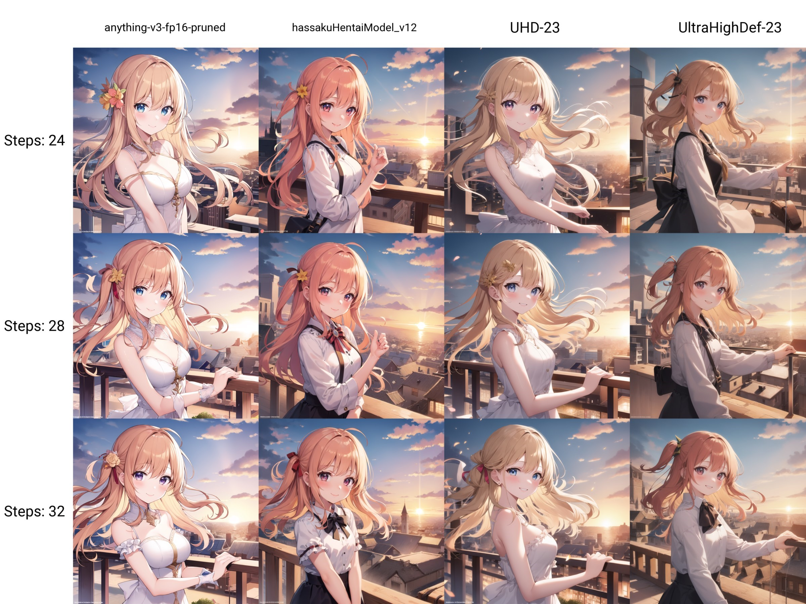

# X/Y/Z Plot Guide  
**By Kha Van**  

## What is It?

The **X/Y/Z Plot** is a powerful script designed for making comparisons and evaluations across different models, prompts, or settings. By utilizing this tool, you can create a comprehensive grid of images generated from various configurations, allowing you to assess which settings produce the best results at a glance.

### Key Features:
- Facilitates the generation of grids with different configurations.
- Helps in visual comparison of different settings.
- Does not require additional VRAM as it generates each image individually.

## Where is It?

The **X/Y/Z Plot** can be found within the **txt2img** and **img2img** tabs of the webui. To access it, scroll down to the **Script** section, click on it, and select **`X/Y/Z plot`**. This will reveal the sub-section where you can begin configuring your plot.

## How to Use

### Axes Configuration:
- **X Axis:** Generates variations horizontally across the grid.
- **Y Axis:** Generates variations vertically across the grid.
- **Z Axis:** Creates an additional XY grid separately.

For each axis, you need to specify the variable type in the left field and then list the values you want to cycle through in the right field, separated by commas.

### Available Types:
Some types, like **`Checkpoint name`**, feature a yellow button that will auto-populate the field with all available values, saving you from manual entry.

## Prompt S/R

### How it Works:
The **Prompt S/R** function scans the prompt for the first value in the field, and during each cycle, it replaces this value with the next one in the list.

### Use Case - Training Evaluation:
Suppose you're evaluating a LoRA model trained across multiple epochs, with filenames in the format `name-000001`. In this case, you can incorporate the model into the prompt as `<lora:name-000001:0.5>`. By using **Prompt S/R** on both the X and Y axes, with values like `01, 02, 03` for the X axis and `0.5, 0.75, 1.0` for the Y axis, the script generates a 3x3 grid. This grid displays different epochs at varying strengths, helping you quickly determine if the training suffered from overfitting and what strength produces the best results.

## Example:

- **Prompt:** `1girl, solo, smile, blush, rooftop, sunset`
- **X axis:** `Checkpoint name`
- **Y axis:** `Steps`

